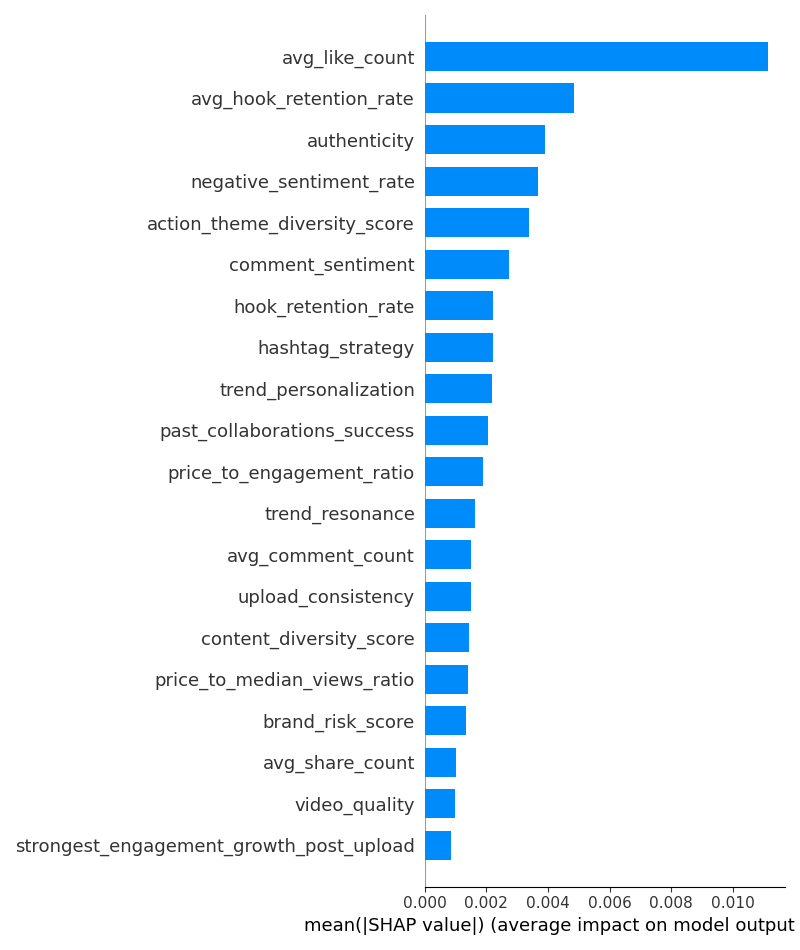
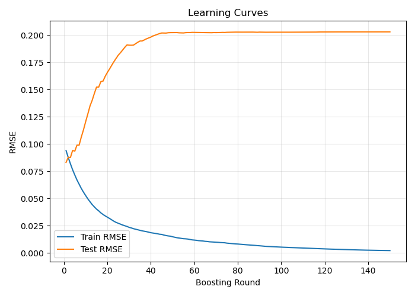
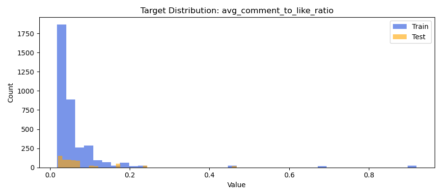

## Yashkumar Dhameliya 
## insights.md

## Overview

This project predicts the average comment-to-like ratio for social video creators using a set of engagement, content, and sentiment features. The workflow avoids data leakage by strictly splitting train and test sets by unique creator_id.

---

## Key Insights

### Feature Importance

- The model identifies **`avg_like_count`** and **`avg_hook_retention_rate`** as the top drivers of engagement.
- Other meaningful features include:
    - **`authenticity`**
    - **`negative_sentiment_rate`**
    - **`action_theme_diversity_score`**
    - **`comment_sentiment`**
    - **`hashtag_strategy`**
- Both XGBoost feature importance and SHAP analysis agree on the critical influence of these metrics.

---

## Creator Example: 54c845c9-e0a1-4c1f-a498-3b5f1c966383
To improve engagement, this creator should focus on increasing their daily profile views and boosting average likes per post—this can be achieved by consistently promoting content across platforms and encouraging viewers to interact with their videos. Additionally, adopting trending themes and improving upload consistency could further enhance their viral potential and audience resonance.

### Visual Summaries

#### SHAP Summary

#### Learning Curve

#### Target Distribution

---

